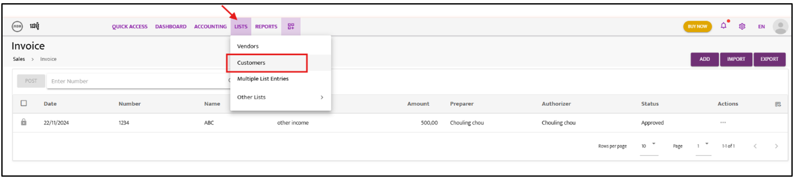
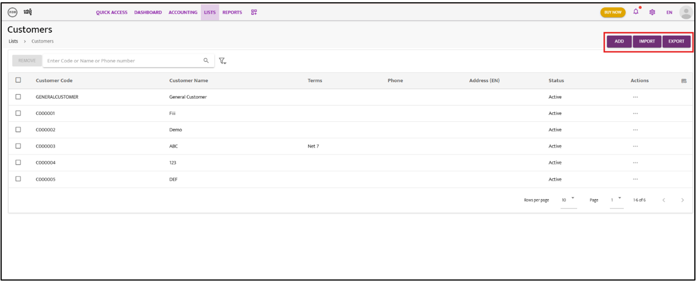
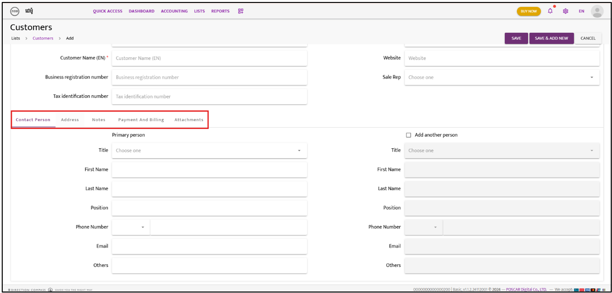

 

# Customers

Follow these steps to create and manage customer records:

---

### **Step 1:**  
Navigate to **“List”** and select **“Customers”** to create a new customer entry.  

---

### **Step 2:**  
Click on **“Add”** to create a customer manually, or use the **Import** or **Export** functions to manage all customer data in bulk.

---

### **Step 3:**  
If creating manually, click **“Add”** and fill in the required customer information.  
  

---

### **Step 4:**  
Choose either **“Save”** or **“Save & Add New”** to complete the action.