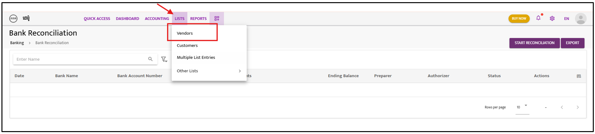
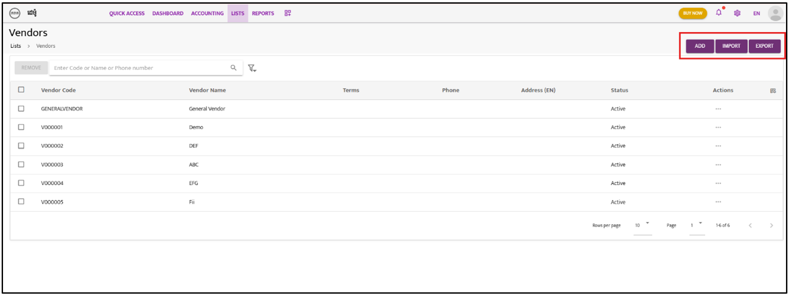
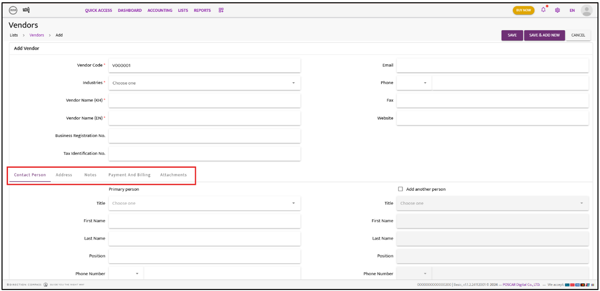

 

# Vendors

- **Step 1**: Go to “**List**” and select “**Vendors**” to create new vendors

- **Step 2**: Click on “**Add**” for create by manual or Import and export all vendor by **import or export function**
- **Step 3**: Choose Add and fill the vendor information

- **Step 4**: Select on “**Save** or **Save & Add New**”
