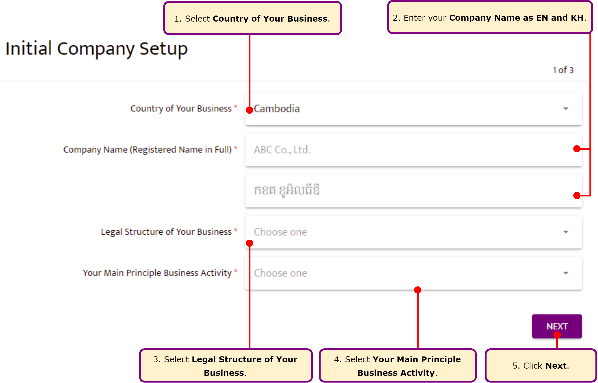
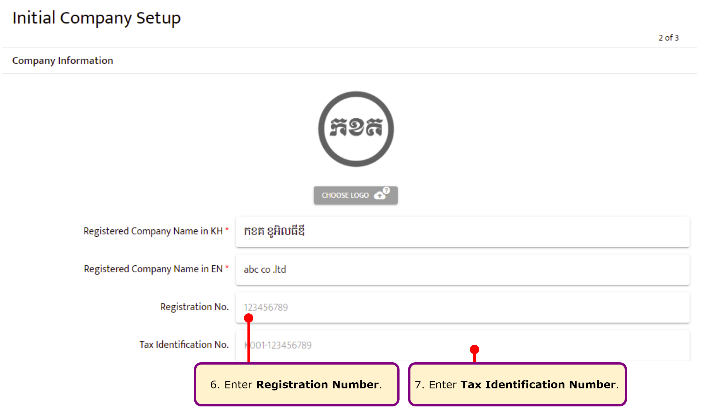
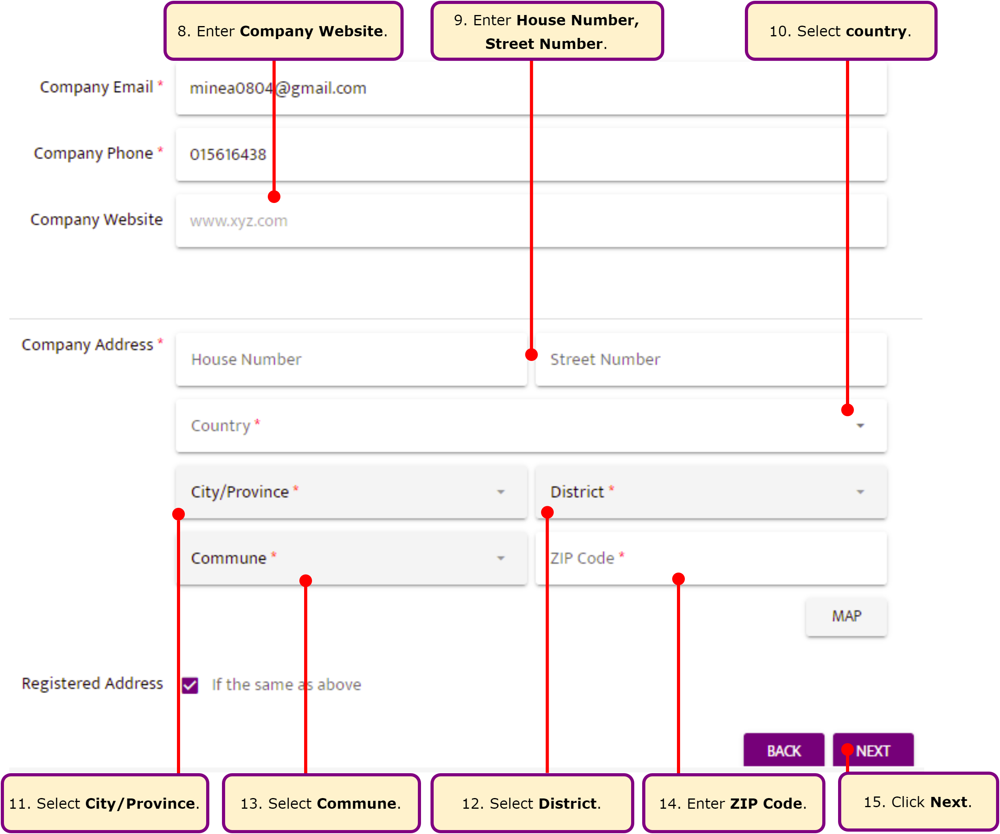
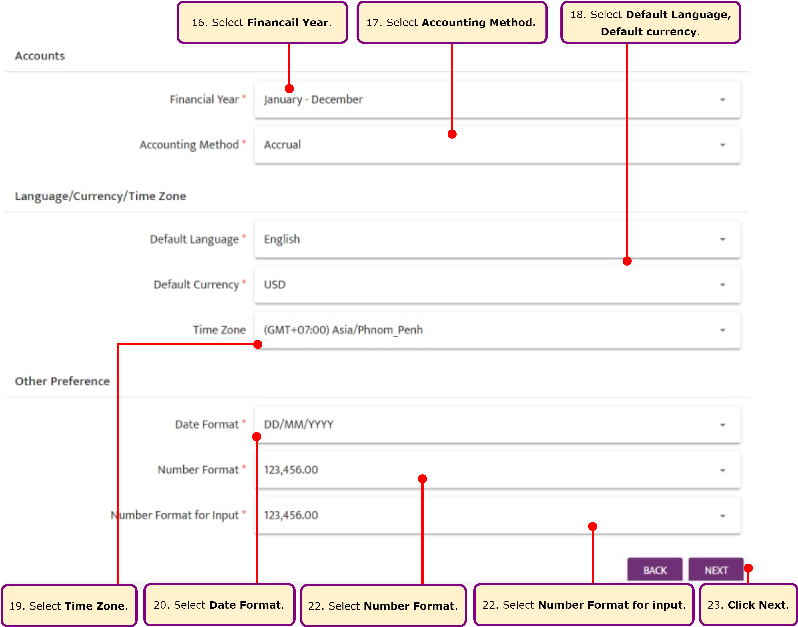
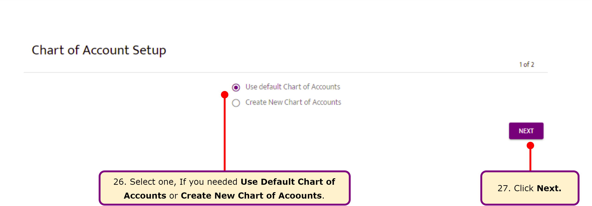
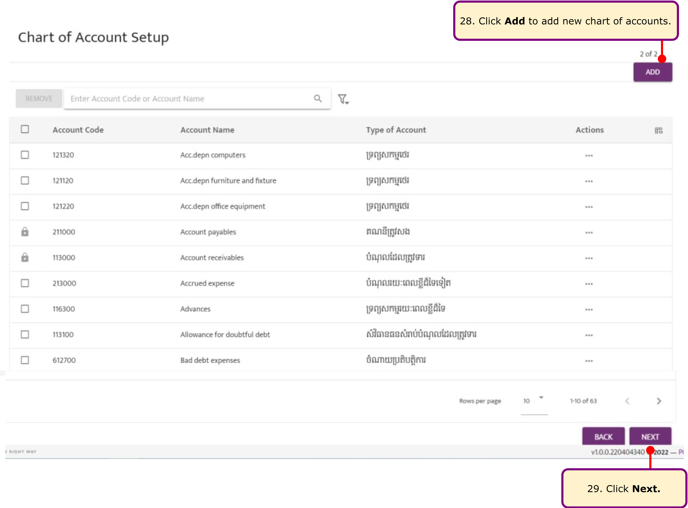
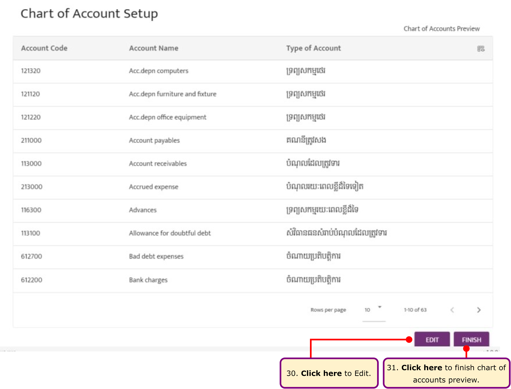
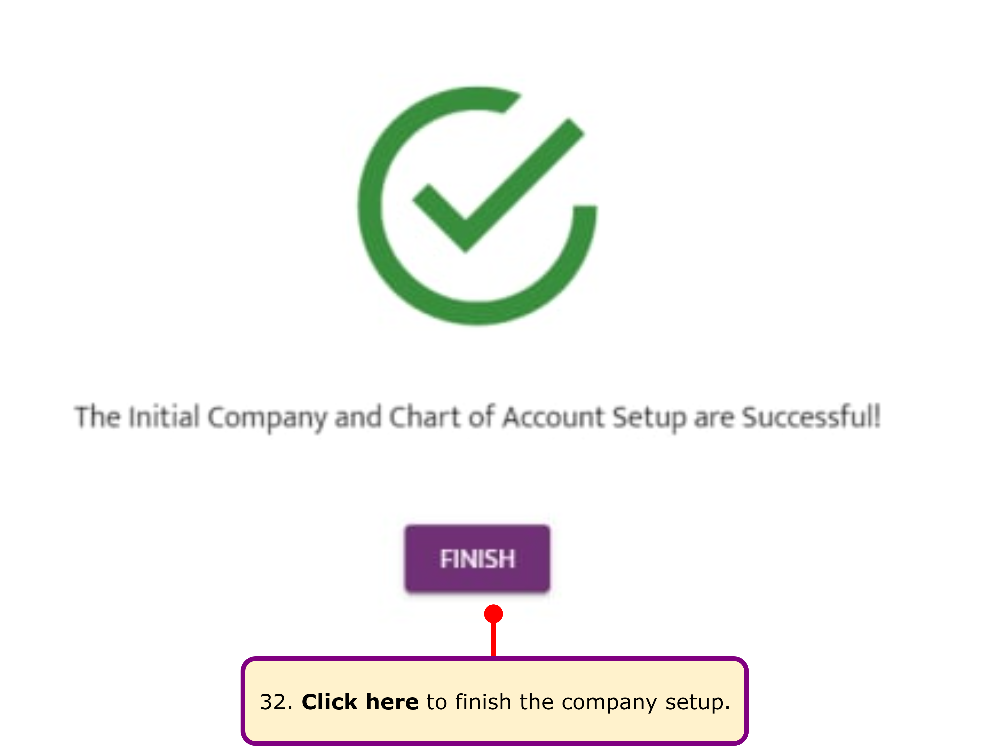

 

# Company Setup

Before setting up your company in **Vithean**, compile the basic company information. It's ideal to have as much information ready as possible, but you can always make changes later.

### **Checklist for Company Setup**
- **Country of your business**
- **Company name**
- **Legal structure of your business**
- **Main business activity**
- **Email, Phone, Address**
- **Financial year, Accounting method**
- **Default language, Default currency**
- **Date format, Number format (display and input)**  

---

### **Step 1: Company Name and Tax Information**
If available, enter your **Registration Number** and **Tax Identification Number** below the company name.  

---

### **Step 2: Enter Company Address**
Provide the company address and registered address.  

---

### **Step 3: Configure Preferences**
Select the following for your company:
- **Accounts**
- **Language, Currency, Time Zone**
- **Other Preferences**  

---

### **Step 4: Review Company Information**
Preview the company setup, including:
- Company Information
- Company Type
- Contact Information
- Address
- Accounts
- Language, Currency, Time Zone
- Other Preferences  

1. To make changes, click **Edit**.  
2. If all information is correct, click **Finish**.  

---

### **Step 5: Choose Chart of Accounts**
Select one of the following:
1. **Use Default Chart of Accounts**: Choose this option to use an existing chart of accounts.  
2. **Create New Chart of Accounts**: Choose this option to create a custom chart of accounts.  

---

### **Step 6: Add Additional Chart of Accounts**
If you have other chart of accounts, click **Add**.

**Note**: Charts of accounts with a lock symbol cannot be removed.  

---

### **Step 7: Preview Chart of Accounts**
Review your chart of accounts.

1. To make changes, click **Edit**.  
2. If all accounts are correct, click **Finish**.  

---

### **Completion**
The initial company and chart of accounts setup are successful.  

