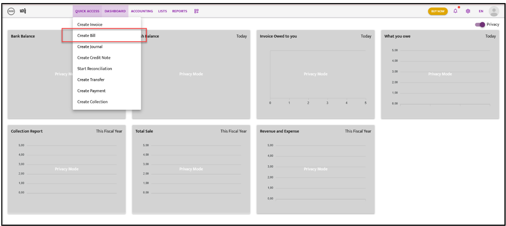
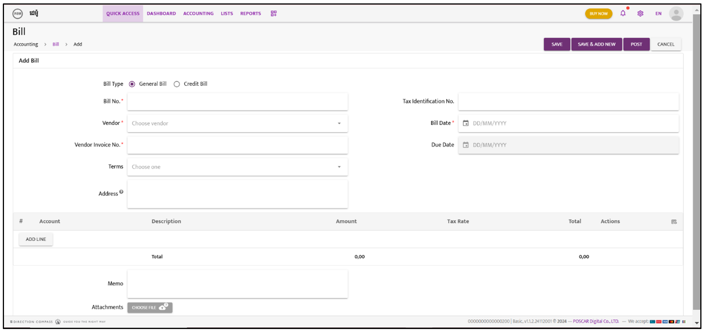
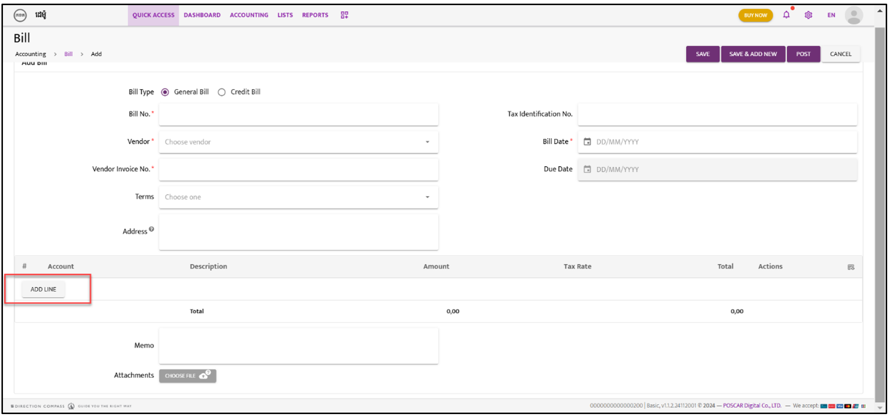

# Bill

When the company receives a bill from a vendor for goods receipt, follow the steps below:

---

### **Step 1:**  
Navigate to **“Quick Access”**. A dropdown list will appear; select **“Create Bill”**.  

---

### **Step 2:**  
The Bill screen will appear. Select either **“General Bill”** or **“Credit Bill”**.

---

### **Step 3:**  
Fill in the **Bill Reference Number** and **Vendor Name** from the dropdown list.

---

### **Step 4:**  
Complete the required information as shown in the snapshot below.  

---

### **Step 5:**  
Click **“Add Line”**.

---

### **Step 6:**  
Click **“Choose one”** to select the account. Then, fill in other details, such as the **Description**, **Amount**, and additional information.

---

### **Step 7:**  
Choose either **“Save,” “Save & Add New,”** or **“Post”** to complete the action.

---

### **Step 8:**  
After saving or posting, the Bill list will appear. Click on the **“Action”** icon and select **“Approve”** from the dropdown list.  

