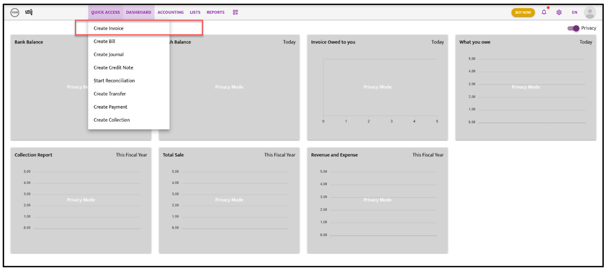
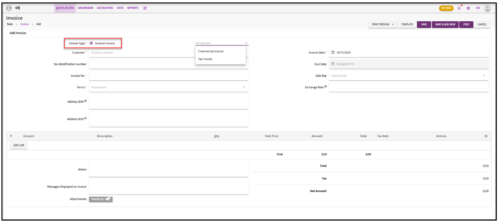
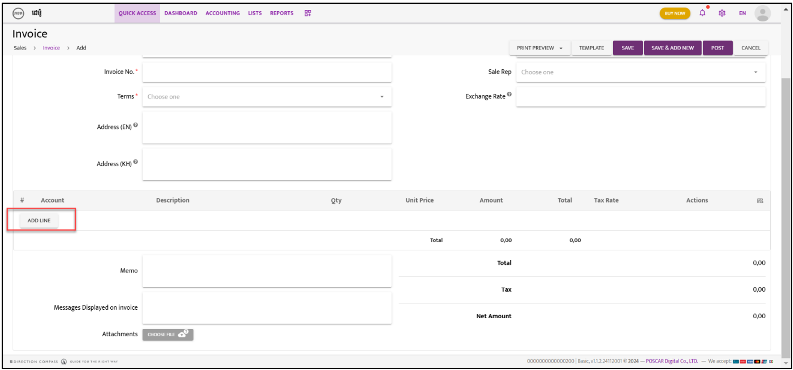

# Invoice
When the company issue invoice we need to follow the below step:

- **Step 1**:  Go to “**Quick Access**” the dropdown list will appear and select on “**Create Invoice**”

- **Step 2**: Invoice Screen will appear and select on “**General Invoice**”

- **Step 3**: On icon “**Choose one**” click on drop down list and select the invoice type
- **Step 4**: To fill the info per below snapshot

- **​Step 5**: Select on “**Add Line**” 
- **Step 6**: Click on “**Choose one**” to select the account then fill in other info i.e. Description, amount, and others
- **Step 7**: Select on **“Save** or **Save & Add New** or **Post**” 
- **Step 8**: After you select on “**Save** or **Save & Add New** or **Post**” the Bill list will appear and we need to click on “**Action**” icon and select on “**Approve**” on dropdown list.
