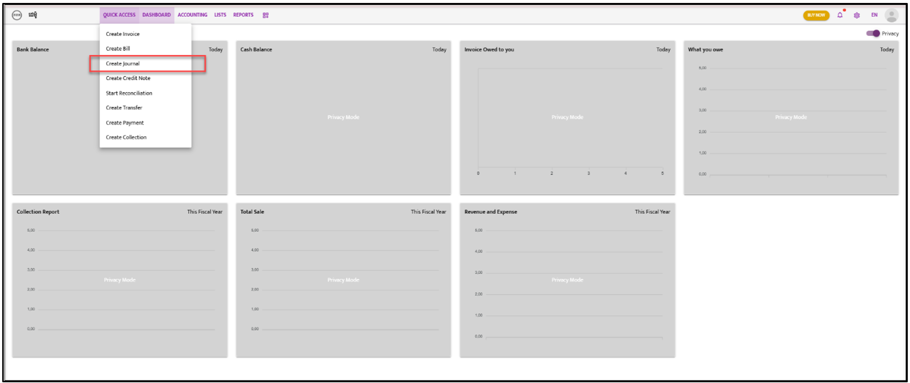
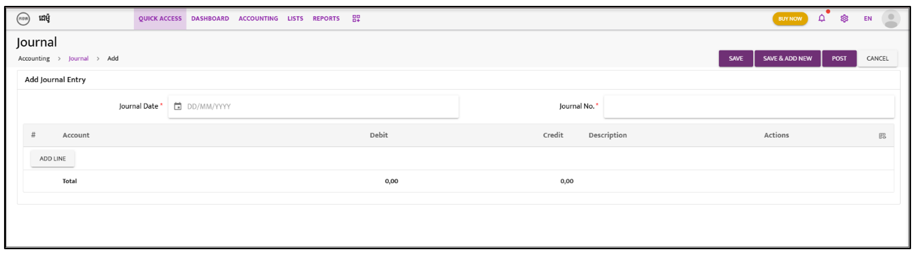

# Journal

Follow the steps below to create and manage journals:

---

### **Step 1:**  
Navigate to **“Quick Access”**. A dropdown list will appear; select **“Create Journal”**.  

---

### **Step 2:**  
Fill in the **Transaction Date** and **Journal Reference Number**.

---

### **Step 3:**  
Click on **“Add Line”**.

---

### **Step 4:**  
Choose the **GL Code** and enter the relevant data.

---

### **Step 5:**  
Select either **“Save,” “Save & Add New,”** or **“Post”** to complete the action.

---

### **Step 6:**  
After saving or posting, the Journal list will appear. Click on the **“Action”** icon and select **“Approve”** from the dropdown list.  

