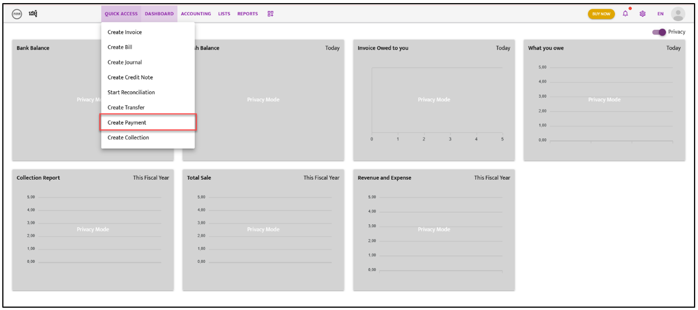
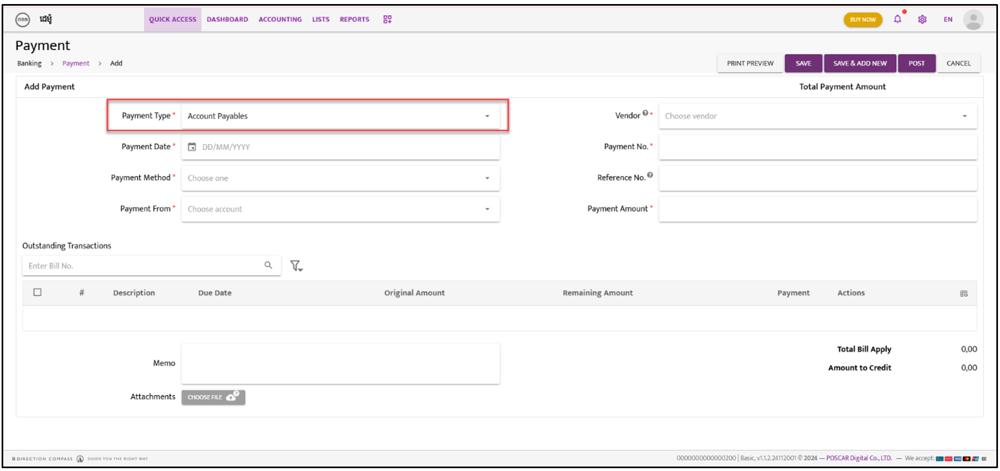

# Payment

Follow these steps to create and manage payments:

---

### **Step 1:**  
Navigate to **“Quick Access”**. A dropdown list will appear; select **“Create Payment”**.  

---

### **Step 2:**  
The Payment screen will appear. Select **“Account Payables”** for making payments to suppliers.

---

### **Step 3:**  
Click on the **“Choose Vendor”** icon. Open the dropdown list and select the **Vendor Name**.

---

### **Step 4:**  
Fill in the required information as shown in the snapshot below.

---

### **Step 5:**  
Choose either **“Save,” “Save & Add New,”** or **“Post”** to complete the action.

---

### **Step 6:**  
After saving or posting, the Credit Note list will appear. Click on the **“Action”** icon and select **“Approve”** from the dropdown list.  

