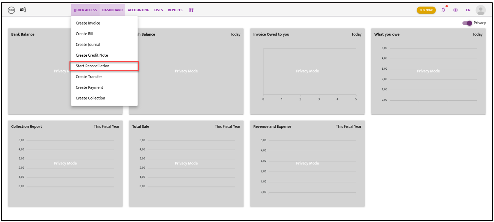
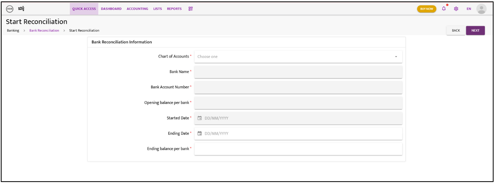

# Start Reconsiliation

- **Step 1**:  Go to “**Quick Access**” the dropdown list will appear and select on “**Start Reconciliation**”

- **Step 2**: On icon “**Choose one**” click on drop down list and select the bank for reconcile
- **Step 4**: Once user has selected the bank, the grey columns will be automatically filled
- **Step 5**: Fill in the “**Ending Date**” of the bank reconciliation period i.e. 30/01/2024
- **Step 6**: Fill in the “**Ending balance per bank**” in accordance with the bank information from the ending period.

