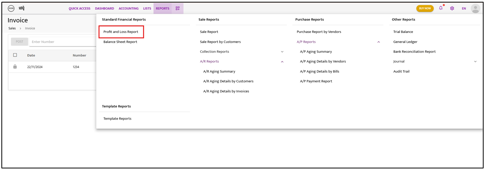
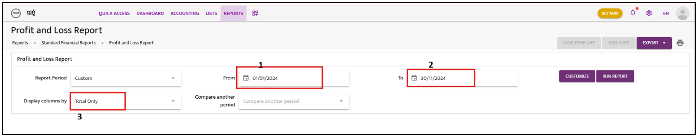
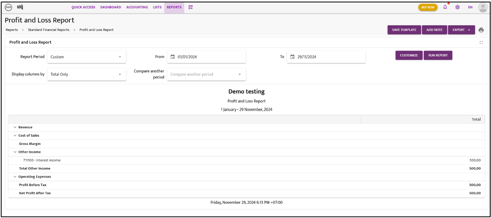

 

# Profit and Loss Report

Follow these steps to generate a Profit and Loss Report:

---

### **Step 1:**  
Click on **“Reports”** and select **“Profit and Loss Report”**.  

---

### **Step 2:**  
Select the **“Date”** for the report and customize the **“Display Column By”** option to show **Total Only** or by **Years**, **Months**, etc.

---

### **Step 3:**  
Click on **“Run Report”** to generate the report.  
  

